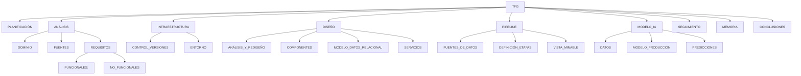

Mostramos el desglose de las tareas más importantes para la correcta realización del proyecto.

Tarea | Descripción
------------ | ------------
**PLANIFICACIÓN** |
	INTRODUCCIÓN | Explicamos el contexto del problema planteado y cómo vamos a implementar la solución.
	ALCANCE | Qué pretendemos conseguir con el proyecto acontando las tareas
	RECURSOS HUMANOS | Aquellas personas que intervienen y la explicación de sus funciones
	COMUNICACIONES | Elementos de comunicación interna y externa, incluimos interesados y clientes.
	METODOLOGIA | Conjunto de procedimientos que usaremos para la planificación y gestión.
	EDT | Estructura en árbol con el desglose en tareas del trabajo
	ENTREGABLES | Creación de los paquetes de trabajo del proyecto
	ESTIMACIÓN DE TIEMPOS | Estimanción en horas para cada paquete de trabajo
	GANTT | Tiempo determinado en el calendario para cada uno de los paquetes de trabajo.
	PLAN DE RIESGOS | Determinaremos los principales riesgos que pueden suceder durante el proyecto y los categorizaremos por nivel de impacto y de suceso.
**ANÁLISIS** |
	CONCEPTOS PREVIOS | Explicamos el contexto del problema planteado y cómo vamos a implementar la solución.
	PROYECTO AGRAI | Presentamos el estado actual de la aplicación AGRAI.
	AUTOMATIZACIÓN | Exponemos los distintos pasos a través de los cuales se transforman los datos.
	CATÁLOGO DE REQUISITOS | Obtendremos los requisitos funcionales y no funcionales del proyecto.
**INFRAESTRUCTURA** |
	ENTORNO | Decidimos los entornos de desarrollo necesarios así como las tecnologías necesarias en cada punto.
	INFRAESTRUCTURA CÓDIGO | Desarrollamos un script para dejar la máquina que contiene la aplicación en un estado estable con todas sus dependencias instaladas.
**DISEÑO** |
	ANÁLISIS MODELO PREVIO | Explicamos el contexto del modelo de datos previos y sus fallos.
	REDISEÑO ENTIDADES | Explicamos qué entidades conformarán el modelo y por qué la base de datos quedará normalizada.
	DISEÑO DE SERVICIOS | Encapsulamos las consultas más frecuentes en servicios fáciles de acceder.
	CARGA CON DATOS | Cargamos el modelo con datos para verificar su consistencia.
	DESPLIEGUE DE APLICACIÓN | Desplegamos la aplicación para comprobar su funcionamiento.
**PIPELINE** | 
	FUENTES DE DATOS | Explicamos las fuentes de datos con las que trabajamos.
	DEFINICIÓN DE ETAPAS | Acotamos y definimos los pasos en los que se transforman los datos hasta llegar al modelo de forma consistente.
	VISTA MINABLE | Seleccionamos del modelo relacional las 'features' para el modelo IA de producción.
**MODELO IA** | 
	DATOS | Exponemos los datos que vamos a utilizar, procedentes de la vista anterior.
	MODELO DE PRODUCCIÓN | Usamos varias técnicas de Inteligencia Artificial para crear un modelo de producción de Kg para el cultivo.
	PREDICCIONES| Utilizamos el modelo anterior dentro del sistema para predecir los kg de cosecha a partir de una fecha dada.
**SEGUIMIENTO** |
	CONTROL | Realizamos pruebas de integración para asegurar la consistencia de los datos.
	GESTIÓN DE TIEMPOS | En una tabla registramos el tiempo estimado, el tiempo real invertido y la desviación del tiempo en cada una de las tareas del proyecto.
**MEMORIA** |
	ESTRUCTURA | Diseñamos la estructura basada en múltiples notas con la documentación y explicaciones del proyecto. 
	REDACCIÓN | Redactamos la memoria a medida que avanza el proyecto.
	EXPORTACIÓN | La memoria se escribe en notas de "markdown" debido a la simplicidad con la que se pueden integrar diagramas y código. Al terminarl, exportaremos la memoria como páginal "html".
	REVISIÓN | Al finalizar el proyecto, revisamos el escrito para asegurarnos de no cometer errores.

