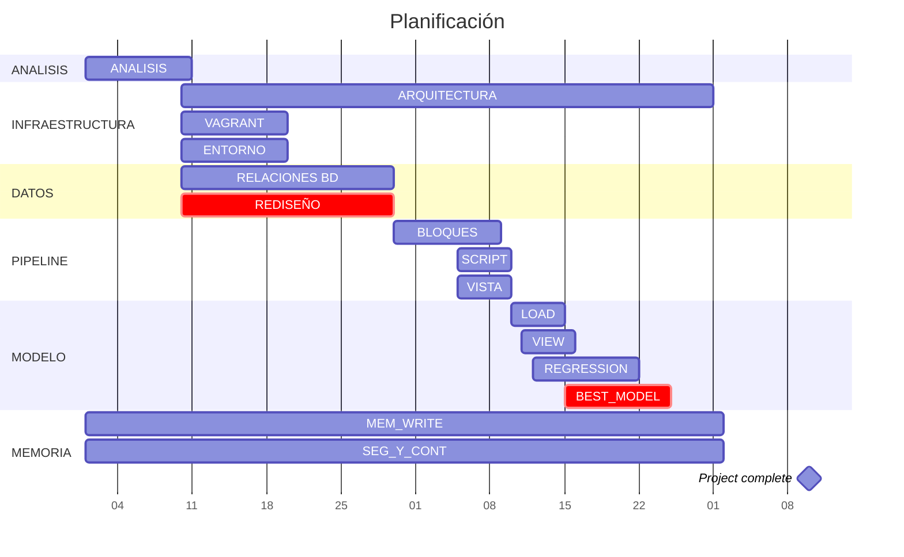

El siguiente diagrama propone un desglose de tareas para la planificación del proyecto. El tiempo estipulado es de dos meses y una semana.

Este diagrama es una estipulación de cómo se desarrolla el proyecto. En la sección final de seguimiento y control analizamos las desviaciones encontradas y cómo han sido solucionados estos contratiempos.

Destacamos que las tareas de escritura de la memoria y pruebas unitarias se realizan durante casi todo el proyecto. Las pruebas nos permiten asegurarnos de que el proyecto funciona adecuadamente: así no pasamos a una nueva tarea si no hemos dejado la aplicación estable al terminar la anterior.