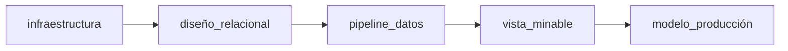

El proceso que vamos a implantar requiere de un diseño que posibilite estructurar y manejar grandes volúmenes de datos. Actualmente, existen varias tecnologías que abordan el concepto de *Pipeline* desde un punto de vista global. No vamos a utilizar ninguna de estas tecnologías; nuestro proceso se va a desarrollar a medida, modelando un Pipeline como patrón de diseño, encargado de la transformación de los datos en bloques reutilizables para su persistencia en el modelo.

El primer paso para realizar una carga de datos, es el diseño de un modelo relacional que soporte esta información de la forma más estructurada y organizada posible. Hará falta la comprensión de conceptos del dominio agronómico para dar sentido a esta información y obtener así un esquema sólido sobre el que poder preguntar sin limitaciones.

Con un modelo relacional para los datos, los bloques atómicos de carga se podrán ejecutar periódicamente utilizando las fuentes de datos necesarias. El proceso de automatización termina, una vez que están almacenados los datos, con la extracción de una vista minable que permite obtener el mejor modelo de regresión para los kg de cultivo que se van a cosechar en una fecha determinada.

