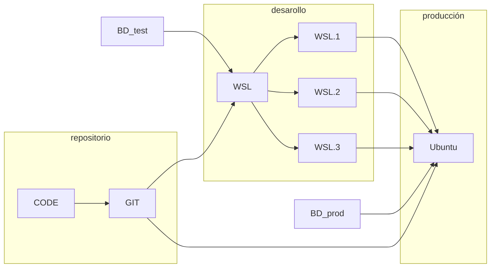

El entorno local, sobre el cual desarrollamos, y el de producción, donde se despliega la aplicación, son actualmente diferentes. Todos los miembros del equipo utilizamos máquinas Windows, mientras que en el servidor de producción encontramos una máquina Ubuntu. Esto crea un problema importante en el proceso de instalación de las librerías necesarias para trabajar con los datos; se pierde gran cantidad de tiempo en preparar el entorno de cada persona que va a trabajar con el repositorio de la aplicación; además, las librerías necesarias necesitan de una gran cantidad de dependencias que varían en cuanto a las versiones. Como solución propondremos una nueva forma de trabajo que nos asegure un entorno común con las mismas librerías y paquetes.



Parte del trabajo consiste en la automatización del despliegue de la aplicación. En este punto vemos cómo la infraestructura como código permite aislar las librerías necesarias creando un script que deja una máquina en estado estable para ejecutar la aplicación.

Para poder utilizar tecnologías que posibiliten la integración continua, transformamos el entorno de desarrollo desplegando la aplicación en UNIX mediante una máquina Vagrant en la que podamos reproducir vairas veces el proceso. Identificamos las siguientes dependencias que necesitan ser instaladas:

- postgres 14 + postgis
- python3.10
- GDAL 3.3.2
- Django
- Virtual-Env [librerías ciencia de datos]

Suele ser complicado encontrar todas las dependencias con sus versiones correctas; en este caso el punto más complicado ha sido la instalación de Python con su versión correspondiente de GDAL, librería que permite tratar con los datos geoespaciales. Además, el sistema gestor de BD, 'postgres', necesita una extensión especial, 'postgis', para poder guardar los datos georreferenciados. Como este tipo de trabajo es casi de prueba y error, la utilidad del script que obtenemos es de gran valor.

El primero de los entregables hace referencia a esta parte del proceso. El siguiente script automatiza la creación de una máquina con las librerías necesarias, el cual, una vez ejecutado, deja la máquina lista para el despliegue de la aplicación.

```bash

#!/bin/bash

curl -fsSL https://www.postgresql.org/media/keys/ACCC4CF8.asc|sudo gpg --dearmor -o /etc/apt/trusted.gpg.d/postgresql.gpg

sudo sh -c 'echo "deb http://apt.postgresql.org/pub/repos/apt $(lsb_release -cs)-pgdg main" > /etc/apt/sources.list.d/pgdg.list'

sudo apt update
sudo apt upgrade

sudo apt install postgresql-14
sudo apt install postgresql-14-postgis-scripts

sudo service postgresql start

sudo -u postgres createuser -P agrai_user
sudo -u postgres createdb -O agrai_user agrai_db
sudo -u postgres psql -c "CREATE EXTENSION postgis; CREATE EXTENSION postgis_topology;" agrai_db

# gdal native:
sudo add-apt-repository ppa:ubuntugis/ppa && sudo apt-get update
sudo apt-get update
  
# cargarte la versión de la máquina, dejar solo 1:
sudo apt autoremove python3

# python repositories

sudo apt install software-properties-common -y
sudo add-apt-repository ppa:deadsnakes/ppa

# python concrete installation

sudo apt install python3.10 # version concreta
sudo apt-get install python3.10-dev python3.10-venv
sudo apt install python3.10-dev python3.10-venv
sudo apt install virtualenv

# python env var

export PYTHONPATH="/usr/local/bin/python3.10:/usr/local/lib/python3.10/lib-dynload:/usr/local/lib/python3.10/site-packages"

alias py=python3.10
alias python=python3.10
alias python3=python3.10

# creacion entorno_venv
sudo python3.10 -m venv ../agrai_venv

# GDAL
sudo apt-get install libgdal-dev

# env gdal lib variables

export CPLUS_INCLUDE_PATH=/usr/include/gdal
export C_INCLUDE_PATH=/usr/include/gdal

# install dep in python agrai_venv

source ../agrai_venv/bin/activate
# pip install --upgrade pip # quitar
sudo python3 -m pip install -r requirements.txt
```