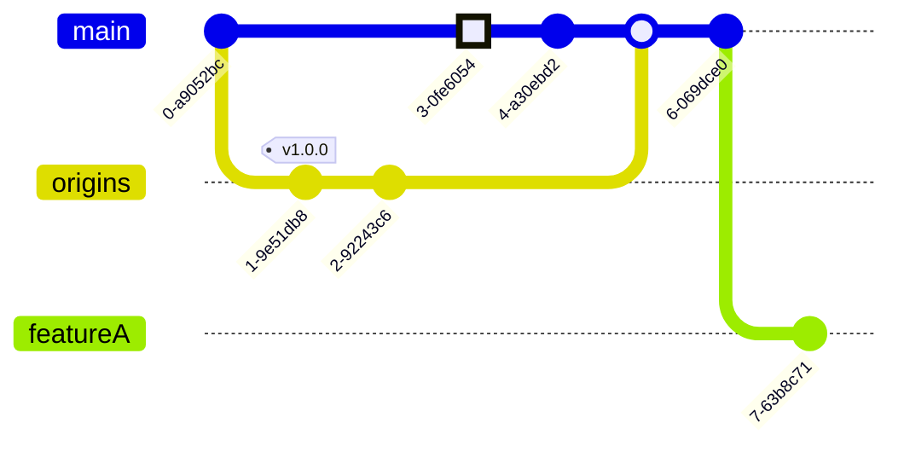

Para poder desarrollar sobre software que está en producción estamos utilizando un sistema de control de versiones básico. Damos unas pequeñas pinceladas sobre cómo evoluciona el software y las ramas que utilizamos. 

El código de la aplicación se encuentra en un único servidor que gestiona su control de versiones a través de SVN, Subversion. El siguiente diagrama muestra el flujo de desarrollo con las ramas creadas para el trabajo independiente sin romper el producto en producción.

Al plantear un nuevo rediseño del producto, el trabajo tiene lugar en una rama diferente a la que se encuentra en producción. Esta nueva rama, Origins, gestionará el rediseño del modelo de datos y la implementación del proceso de automatización de los datos. Si el trabajo evoluciona correctamente, los futuros merges no deberían ser problemáticos.