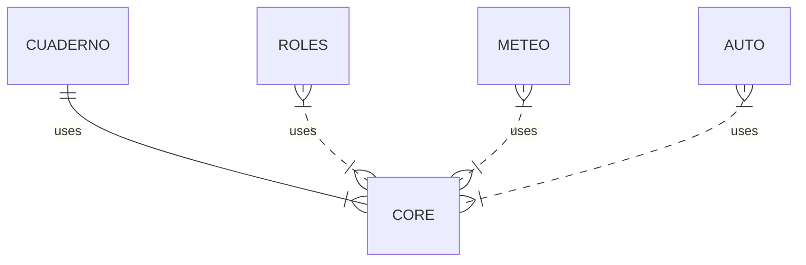

Cuando comencé a trabajar con la aplicación, todo el código se encontraba en un único paquete con muy poca forma. A medida que se he ido refactorizando, se han creado entidades para modelar los datos y éstas se han estructurado en componentes atómicas de la aplicación.




En Django podemos crear un proyecto compuesto por varias aplicaciones. En la documentación oficial se explica cómo funciona la arquitectura del framework y se exponen ejemplos para que, una vez creadas, podamos acoplar y desacoplar las aplicaciones al proyecto. Es una forma similar de trabajo al modo en que organizamos una librería en múltiples paquetes, pero un poco más complicada debido a que el ORM subyacente traduce los modelos a tablas en una BD. Veamos cómo con solo añadir o quitar un string en nuestro settings activamos o desactivamos la aplicación en el proyecto.

```python

INSTALLED_APPS = [
	'django_apscheduler',
	'django_extensions',

	'django.contrib.admin',
	'django.contrib.auth',
	'django.contrib.contenttypes',
	'django.contrib.sessions',
	'django.contrib.messages',
	'django.contrib.staticfiles',
	'django.contrib.gis',

	'core',
	'meteo',
	'roles',
	'cuaderno'
	'auto'
]

```

Estas aplicaciones pueden comunicarse entre sí a través de sus modelos y servicios. En la siguiente tabla explicamos qué hace cada sub-aplicación.

ENTIDAD | DESCRIPCIÓN
:----------------|-------------:
Core | Como toda la información que se va a almacenar es referente a las parcelas y sus datos, toda la BD gira en torno a la tabla “Parcela”.
Roles | Separa los interesados que realizan acciones sobre el parcelario de las entidades principales
Meteo | Gestiona la comunicación y descarga de datos de estaciones meteorológicas
Cuaderno | Extiende el almacenamiento de datos relacionado con incidencias en el parcelario.
Auto | Contiene scripts y dependencias externas para la automatización de procesos, como la descarga de imágenes satelitáles.

Esta división en aplicaciones permite desarrollar y hacer pruebas solo con aquella parte del proyecto que necesitemos en el momento dado. Más importante aún la claridad y sencillez de los modelos de cada componente y su respectiva representación en la BD.


