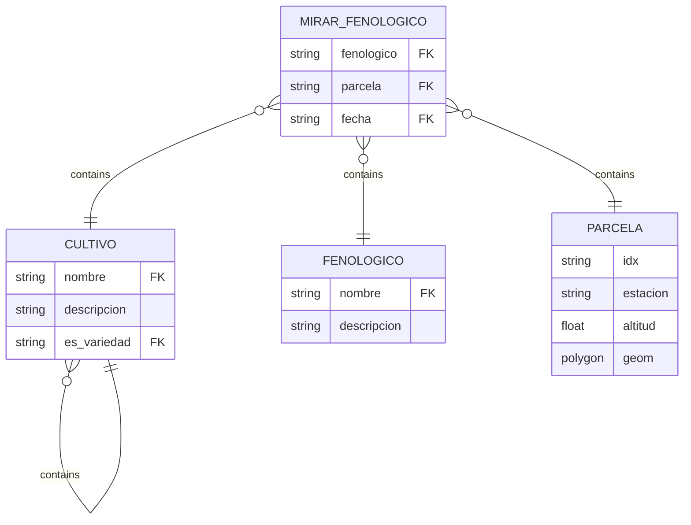
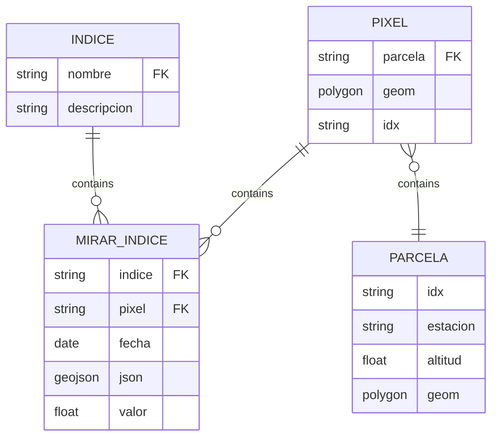
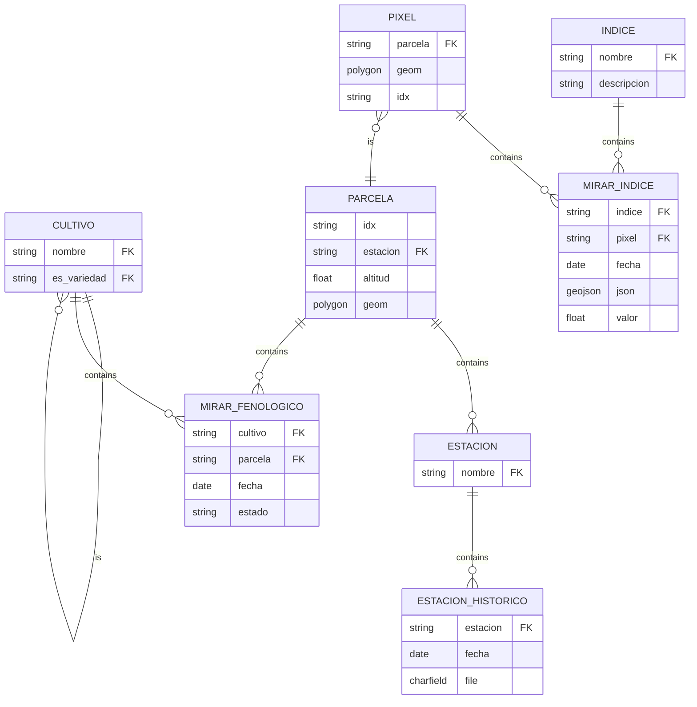

Como inicio de la posterior automatización, se reestructura la arquitectura de la aplicación junto con su BD para soportar el almacenamiento de nuevos datos. El siguiente esquema de BD es el resultado de la implementación del análisis descrita en el planteamiento.

Para la creación de este modelo he trabajado con el equipo en la identificación de los conceptos que necesitaban ser representados. El diseño en papel da la posibilidad de pensar abiertamente sobre las relaciones entre entidades, además de permitir la transmisión de ideas de forma sencilla durante las reuniones.
  
Dentro del entorno de trabajo de _Django,_ el ORM proporcionado aísla la base de datos y nos permite diseñar directamente en _Python_ dicho modelo. Las entidades se diseñan como clases y las relaciones entre ellas se especifican mediante el lenguaje de mapeo proporcionado. De dicha forma creamos las claves foráneas que físicamente contiene la base de datos.

La utilización de este ORM es una ventaja que nos evita usar SQL directamente y permite poblar la base de datos mediante comandos _Python_ desde la terminal. De todas formas, la localización física de la BD necesita ser enlazada correctamente. Este aislamiento posibilita utilizar diferentes bases de datos en los entornos locales y de producción.

Varias etapas han sido necesarias hasta llegar a un punto más o menos estable. La herramienta _Graphviz_ ha permitido obtener diagramas UML que visualizan la estructura de clases del modelo a partir del código. Esta representación gráfica ha sido realmente útil para poder pensar sobre el diseño a medida que avanzaba.

### Entidades Principales ###

De la situación inicial, nos quedamos solo con las entidades principales. Esta selección de entidades se realiza cuidadosamente para que la aplicación pueda contemplar la mayor información posible haciendo uso de un esquema sencillo pero robusto. Analizamos el diseño detalladamente en los siguientes puntos.

 

Este rediseño contempla la mayoría de casos posibles para el posterior tratamiento y procesamiento de datos, con posibilidad de crear buenos modelos predictivos. A continuación se describen las entidades principales contempladas en la base de datos.

ENTIDAD | DESCRIPCIÓN
:----------------|:-------------
Parcela | Como toda la información que se va a almacenar es referente a las parcelas y sus datos, toda la BD gira en torno a la tabla “Parcela”.
Cultivo | Esta tabla está directamente unida a la anterior, ya que un cultivo puede tener muchas variedades diferentes se modela de forma recursiva con una clave foránea a sí mismo (leer el siguiente punto, Ej: Guisante es un tipo de cultivo, pero tiene varias variedades: tirabeque, snap peas…).
Indice | Esta taba es de vital importancia para el funcionamiento de la aplicación, toda nuestra información lleva a estos datos vegetativos. Serán datos calculados en un dominio, esto se hace así ya que existen cientos de formas de denominar un mismo índice de vegetación y podría ser confuso a la hora de realizar las consultas. Para ello se establecerán algunos campos determinados en el campo “tipo_indice” y se les dará un valor en “valor_indice”.
Mirar_Indice | Contempla un histórico de datos y permite dar valor concreto a un índice vegetativo en una fecha única.
Fenologico | Permite registrar diferentes estados fenológicos por los que puede pasar un cultivo. La relación entre el estado fenológico y el cultivo se realiza a través de la tabla Mirar_Fenologico.
Mirar_Fenologico | Permite dar carácter temporal al estado fenológico de un cultivo. Registramos un estado para un cultivo en una fecha concreta. 
Campaña | Es una tabla muy importante, sirve para unir distintos tipos de registros (desde variedades hasta labores de campo pasando por unir los datos de parcelas y subparcelas).
Interesado | Permite realizar el diseño de roles mediante su clave foránea a una parcela. Un intereseado (stakeholder) es una persona que tiene relación con una o varias parcelas (Ej, cultivador, propietario, etc).

 

### Diseño del Cultivo y Fenología

Una decisión complicada sobre el posible histórico de datos es el registro de la evolución de un cultivo en una parcela concreta. Mediante la tabla MIRAR_FENOLÓGICO damos carácter temporal al cultivo concreto de una parcela. De esta forma podemos registrar cuáles son los estados por los que ha pasado un cultivo, desde su "siembra" hasta su "recolección".

El modelado de la entidad FENOLÓGICO ha sido una decisión complicada debido a que no se enlaza directamente con un cultivo. Entendemos que un estado como puede ser el de "siembra" tiene un carácter general y tiene sentido como entidad en sí misma (todos los cultivos pasan por siembra). Es su relación con CULTIVO mediante MIRAR_FENOLÓGICO lo que dice que dicho cultivo está en un estado fenológico concreto en un momento determinado. Por ejemplo, podemos decir que el cultivo "vid" estaba en estado de "siembra" el día "2022-01-23". 

También es importante destacar que CULTIVO es simplemente el tipo que se ha registrado, por lo tanto, para que la información sea completa, un avistamiento fenológico sucede sobre un tipo de cultivo físicamente sembrado en una PARCELA.  El siguiente esquema muestra cómo estas tres entidades se relacionará para dar carácter temporal y espacial a un tipo de cultivo.

Otro punto importante de la aplicación es la contemplación de variedades. Para poder mantener una jerarquía con las posibles entidades registradas en el sistema, enlazamos de forma recursiva el cultivo con una clave foránea a su misma tabla. Esta estructura permite el desglose de una jerarquía de cultivos en la que sabemos qué entidad es una subvariedad de un cultivo, dando la posibilidad de almacenar múltiples niveles.

 

### Diseño de Índices Vegetativos

Para nuestro sistema de información una parcela es una agrupación de varios píxeles. Entendemos como PIXEL a la imagen satelital más pequeña que se puede obtener sobre el terreno, a partir de la cual obtendremos los índices vegetativos. *(El valor del índice es una caja negra para este trabajo, proviene de scripts desarrollados por el resto del equipo)*

El trabajo con índices vegetativos por parte del equipo es uno de los puntos más importantes para que el rediseño sea satisfactorio. La entidad MIRAR_ÍNDICE es de vital importancia en el modelo, permite gestionar el histórico de valores de los índices para todos los píxeles. Esta tabla es una de las candidatas para realizar optimización en las consultas, algo que desde el ORM que utilizamos todavía queda un poco lejos. 

El volumen de datos que la tabla MIRAR_INDICE puede contener es grande. Solo con la muestra representativa de las 25 parcelas con las que estamos trabajando (3000 píxeles), dos índices registrados, y contemplando sus valores en 6 fechas distintas, obtenemos un conjunto de 36.000 valores. Cuando la aplicación escale a un mayor número de parcelas, esta tabla será susceptible de utilizar índices (BD).

Este diseño de índices permite mantener un histórico de datos preciso. Gestiona la evolución de los cultivos a través de las diferentes fechas en las que se persisten los valores de los índices. Destacamos que cada índice se corresponde con una capa de visualización sobre el visor GIS que contiene la presentación de la aplicación, requisito que hace que tenga mucha importancia el poder añadir índices a los datos a media que se vayan contemplando.

### Diseño de Roles

Aunque es un punto secundario, la aplicación contempla que diferentes usuarios puedan realizar diferentes acciones. Recordamos que habíamos separado en componentes la aplicación, y los roles se encuentran en un módulo secundario independiente de las entidades anteriores, que representaban los principales conceptos agronómicos y vegetativos. El diseño modular del modelo de datos permite al equipo añadir diferentes roles sin que estos estén *hardcoded* en el código de la aplicación. 

Aunque la aplicación hace uso de estas entidades, no serán tan importantes para el desarrollo posterior del trabajo, debido a que la parte que necesita automatizarse es aquella relacionada con los índices vegetativos y la geometría de las parcelas anteriores. Como decíamos, estas entidades quedan separadas en un módulo de la aplicación con la única funcionalidad de controlar el acceso a la aplicación y dar permiso a las funcionalidades que cada cliente puede realizar dependiendo del rol que tenga asignado. La siguiente tabla describe los roles hasta ahora contemplados por el equipo y su relación con el parcelario.

ROL | DESCRIPCIÓN
:----------------|-------------:
Cultivador | persona encargada de realizar los mantenimientos en campo
Propietario | propietario catastral de las parcelas
Cooperativa | entidad que agrupa a técnos con diferentes cargos sobre un parcelario
Técnico | personal asignado a un número de parcelas.

### Modelo Final

El siguiente diagrama recoge todas las relaciones descritas anteriormente y muestra el esquema completo que usa la aplicación. En los siguientes puntos hablaremos sobre los métodos definidos sobre este esquema de datos, dónde se localizan y cómo han de ser utilizados.

