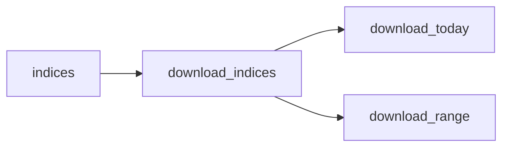

En ingeniería de software, un **patrón de diseño** es una solución general y reutilizable para un problema común dentro de un contexto dado. El término "pipeline" puede hacer referencia a diferentes soluciones y contextos. De momento vamos a centrarnos en su aplicación como patrón de diseño ya que en nuestra aplicación se está utilizando como tal.

**Podemos definir un pipeline como una cadena de elementos de procesamiento (procesos, subprocesos, rutinas, funciones, etc.) dispuestos de modo que la salida de cada elemento sea la entrada del siguiente; el nombre hace referencia al flujo de una o varias tuberías.**

En nuestro caso vamos a utilizar la arquitectura de comandos que proporciona Django para diseñar los procesos de transformación de datos que van a poblar la base de datos. La definición y reutilización del proceso de población es muy importante debido a la forma de trabajo que tiene la empresa con diferentes clientes. Dependiendo del cliente se prepara una copia de la aplicación para trabajar con sus datos; por ello una vez definidas las unidades atómicas del proceso de carga de datos, se podrán diseñar diferentes pipelines para cada cliente. Para este trabajo nos conformaremos con el diseño y la implementación de un proceso general, pero manteniendo la idea de que pueda ser escalado más adelante.

```python

from django.core.management.base import BaseCommand

class Command(BaseCommand):

    def handle(self, **options):
    
        # now do the things that you want with your models here
        
```

Las líneas de código anteriores hacen referencia a una implementación concreta del patrón mencionado.  Fijándonos en la siguiente figura, la clase **Command** sería el handler; el método **handle** corresponde con *handleRequest* del esquema. Los próximos scripts que creemos serán los clientes de estas clases. Destacaremos que la implementación de Django de este patrón es un poco más compleja porque los comandos que encapsulan la funcionalidad permiten tomar diferentes parámetros. 


Con este patrón desarrollamos la infraestructura necesaria para cargar los datos en el modelo. Cada comando representa un proceso de carga de datos, el cual se puede componer posteriormente dentro de un proceso más complejo. Cada unidad de carga se comporta como un filtro que añade de forma ordenada la información al modelo de datos, enlazando las entidades con sus datos correspondientes. Utilizaremos estas unidades para generar diferentes tuberías que permitan dejar varias instancias de la aplicación en estados diferentes.

Para AGRAI hace falta transformar los datos de índices vegetativos que maneja el equipo en información ordenada que llegue al modelo de datos desarrollado anteriormente. A continuación explicamos el flujo de procesos de carga más utilizado.

Los datos principalmente provienen de *Qgis*, software para trabajar con información georreferenciada. El equipo pre-procesa la información sobre los índices vegetativos y da valores a los píxeles mediante dicho software. La principal función de este trabajo es dar sentido a esa información, guardando los datos tomados junto con sus relaciones con el parcelario físico.


La información de los píxeles tiene que enlazarse con los datos de parcelas y cultivos. Cuando obtenemos los índices vegetativos solo contemplamos la información sobre la geometría de la parcela, no sabemos nada más. Esta información tiene que almacenarse junto con el cultivo, el estado fenológico, los datos físicos de la parcela, etc. En la siguiente tabla explicamos cada uno de los [scripts](https://github.com/alesteba/tfg/tree/main/entregables/pipeline) que conforman los procesos del pipeline.

SCRIPT | TAREA
:----------------|-------------:
load_qgis | Extrae la información geomrética de cada pixel proveniente de "qgis" e inserta dicha información en las tablas de "parcela" y "pixel" de la BD. 
load_parcela | Lee de un excel información fisca sobre las parcelas e inserta los datos en la BD.
load_cultivos | Lee de un excel información sobre cultivos con sus variedades e inserta los datos en la BD.
download_img | Usa uno de los módulos desarrollado por el equipo para descargar índices vegetativos a partir de imágenes satelitales. No almacen nada directamente, devuelve un dataframe con los datos descargados.
load_indice | integra la información de índices descargada en el paso anterior en la tabla de "pixel" de la BD.

Para entender detalladamente qué hacen los scripts de carga de índices tenemos que explicar algunos de los procesos de automatización de los que hacemos uso. 



Estos scripts nos permiten crear el flujo necesario para que la aplicación procese la información y termine en un estado consistente. Parte del proceso necesita ser automatizado y ejecutado reiteradamente, añadiendo los datos a la BD y relacionándolos adecuadamente. En nuestro contexto agronómico, es la descarga de índices la parte del proceso que necesita ser automatizada, mientras que los datos de las parcelas y cultivos y la información geoespacial se pueden cargar directamente en el despliegue de la aplicación. 

Con esta estructura de tuberías lista, podemos reutilizar cualquier parte del proceso. Un planificador de tareas nos ayuda a establecer el tiempo que tiene que transcurrir entre las descargas.  Se ha utilizado el scheduler por defecto del framework de Django que estamos utilizando para esta gestión de tiempos y descarga.

Finalmente, para realizar pruebas, queremos crear un único script que ejecute el proceso de forma ordenada. El resto de tuberías que se adjuntan en el proyecto tienen una forma similar y hacen el mismo uso de los comandos de Django que hemos explicado.

```python

class Command(LoggingBaseCommand):

	help = 'Carga la geometría a las parcelas y a los pixeles'
	
	BASE_DIR = Path(__file__).resolve().parent.parent.parent.parent
	PARCELA_SHAPE = BASE_DIR / 'data' / 'parcelas' / '25' / 'parcelas.shp'
	PIXEL_SHAPE = BASE_DIR / 'data' / 'parcelas' / '25' / 'pixeles.shp'
	FICHERO_PATH  = BASE_DIR / 'data' / 'excels' /  'datos-test-2.xls'
	TRILINEA_PATH = BASE_DIR / 'data' / 'trilineas' / 'PRilineas.json'

	def handle(self,  *args, **kwargs):
	
		self.run()
	
	def run(self):
	
		fecha_start = datetime.strptime('2022/06/01', '%Y/%m/%d')
		fecha_end = datetime.strptime('2022/07/01', '%Y/%m/%d')
	
		call_command('1-load-qgis', parcelas=self.PARCELA_SHAPE, pixels=self.PIXEL_SHAPE)

		call_command('2-load-parcela-data', excel=str(self.FICHERO_PATH))
		
		call_command('3-load-cultivos', excel=str(self.FICHERO_PATH))
		
		call_command(
		
			'4-download_img',
			date1=fecha_start,
			date2=fecha_end,
			pixels=self.PIXEL_SHAPE,
			indices=['ndvi', 'ndre']
			)
		
		df = pd.read_csv('down_img.csv')
		
		call_command('4-load_range', data=df, indices=['ndvi', 'ndre'])
```


Además de este último, podemos crear varios entornos con tuberías diferentes que den como resultado bases de datos con estados distintos. Como mencionábamos anteriormente, esto es muy útil debido al funcionamiento del equipo en relación con el procesamiento de datos con varios clientes. La aplicación puede trabajar con instancias diferentes de la misma base de datos dependiendo del proyecto en el que se encuentre; por ejemplo, la misma instancia de la BD sirve tanto para una bodega con variedades de vino como para una cooperativa que contempla varios cultivos como guisantes, olivas, peras, etc.

Por último, este patrón nos permite ejecutar comandos de forma asíncrona y gestionar los procesos con un planificador. Actualmente, aunque el tiempo de carga es alto, podemos asumir una carga lenta. Pero es este mismo patrón de diseño el que nos puede permitir a futuro la carga asíncrona de los datos en cada una de los componentes que lo forman.

```python

def run (self, DATA, INDICES):
	
	for indice in INDICES:
	
		df = DATA.copy()
		
		drop_cols = []
		
		for col_name in list(df):
		
			if indice.upper() not in col_name:
			
				if (col_name == 'ID'):
			
			continue
			
			drop_cols.append(col_name)
		
		df1 = df.drop(drop_cols, axis=1)
	
		call_command('4-load_indice', data=df1, indice=indice)
```

Adjuntamos en los entregables los [scripts](https://github.com/alesteba/tfg/tree/main/entregables/pipeline) que forman este proceso de almacenamiento de datos. 

