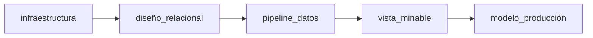

Este trabajo se ha centrado en el desarrollo de un proceso de automatización que permite la integración continua del flujo de trabajo del equipo para una aplicación de gestión agronómica. Hemos pasado por casi todas las etapas de diseño e implementación, además de la final inclusión de los modelos predictivos para la producción de cultivo.

Durante el proceso hemos influido en los principales bloques de diseño e implementación relativos a la arquitectura de la aplicación, pasando por la infraestructura, los modelos de datos, la carga de estos datos, y la búsqueda de modelos predictivos a partir de ellos. Acorde al alcance planteado, hemos llegado satisfactoriamente a todos los puntos estipulados; recodamos estos puntos:

-   Obtenemos un script de creación para el entorno necesario.
-   Diseñamos un modelo relacional de datos que permita un rápido escalado de la aplicación.
-   Automatizamos el proceso de trasformación de los datos mediante el diseño de un pipeline.
-   Diseñamos un algoritmo que exporte la vista minable necesaria para predecir la producción.
-   Utilizamos técnicas de lA para entrenar el mejor modelo de regresión para la producción anterior.
-   Implementamos el modelo para predecir nuevos valores que no han sido usados en el entrenamiento.

Para finalizar, volvemos a los conceptos de los procesos 'lean' que mencionábamos al principio. La fácil comprensión que permiten los esquemas de datos aquí planteados dotan al equipo de trabajo del lenguaje ubicuo necesario para que el software pueda crecer y ser escalado, evitando bloqueos por falta de comprensión. El lenguaje que maneja el equipo está directamente relacionado con su buen funcionamiento y garantiza el proceso de  optimización continua. Los artefactos obtenidos y la explicación de los modelos quedan así como documentación interna que debe ser mantenida al mismo nivel de importancia que el software que la implementa. 

En cuanto a la aplicación, se ha conseguido terminar con un producto funcional que cumple con los requisitos planteados. El proceso de arquitectura conseguido facilita el uso de múltiples datos provenientes de las fuentes estudiadas. El esquema de datos relacional implementado soporta la carga de los índices vegetativos, así como el resto de información relativa al parcelario. Los bloques atómicos de carga diseñados permiten planificar y automatizar la ingestión de los datos provenientes de las fuentes descritas. Por último, la capacidad para utilizar modelos de regresión sobre los datos dota a la arquitectura de la capa necesaria para realizar predicciones y configurar los estudios necesarios. Hemos conseguido crear las bases de un proceso que tiene un gran potencial para monitorizar y proporcionar una adecuada toma de decisiones sobre conceptos agronómicos.

(recortar y hasta aquí:)