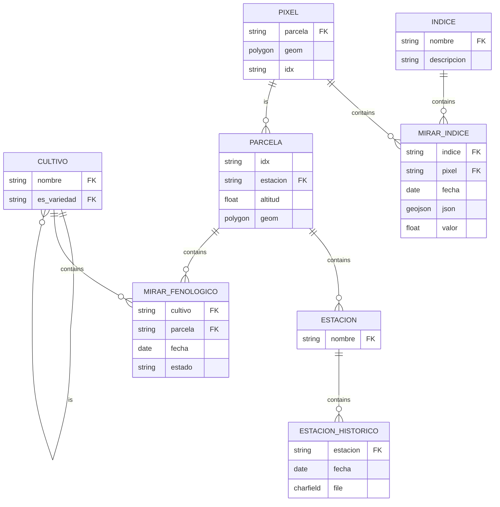

Para la documentación interna del equipo es muy importante tener claro el esquema de datos sobre el que se está trabajando, el acceso a la información será más fácil y rápido. El siguiente diagrama contiene el resultado final del modelo que utiliza actualmente la aplicación. En la sección correspondiente de la memoria se encuentran las explicaciones necesarias en caso de que no se entienda alguna relación con solo esta información.

